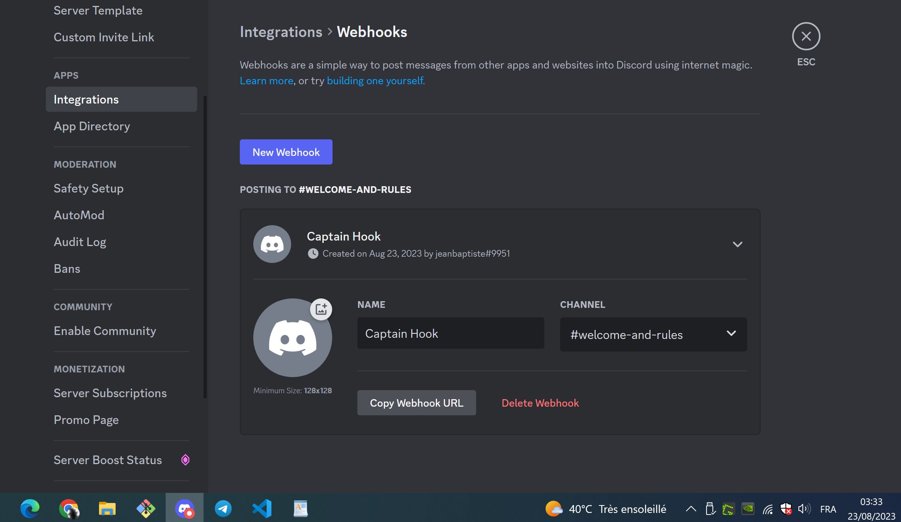
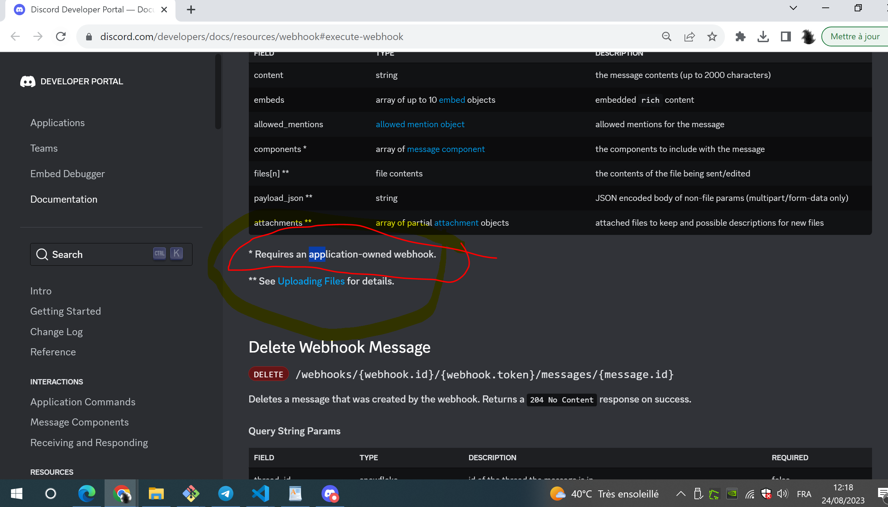

# Discord bot

## An issue I encountered

Te issue : 
* I worked on how to send a discord notification.
* I created a webhook in my discord server settings > integration menu
* And in the CI, I send an HTTP request with the full URL of the webhook I created. I send this HTTP request, using POST method, and provide JSON payload
* Following the docs, I tried to add a `"components"` property in the JSON payload, to get buttons etc : And it would never work, the webhook is successfully eecuted, the message does arrive on Discord, but none of the _components_ I wanted to add appear
* Well I found out later what the issue was : 
  * In the Discord world, a Webhook can be Owned by an application (an OAuth2 app), or not. Meaning the webhook can exist without any OAuth2 appplication.
  * But the webhooks which are not owned by an OAuth2 appliation ARE NOT allowed to use `"components"` : 
    * see https://github.com/discordjs/discord.js/issues/7097#issuecomment-991301509
    * and see on the offiical discord docs (below a screenshot of that page) : https://discord.com/developers/docs/resources/webhook#execute-webhook-jsonform-params

## Refs 

* https://discord.com/developers/docs/resources/webhook#execute-webhook-jsonform-params
* https://github.com/discordjs/discord.js/issues/7097#issuecomment-991301509

