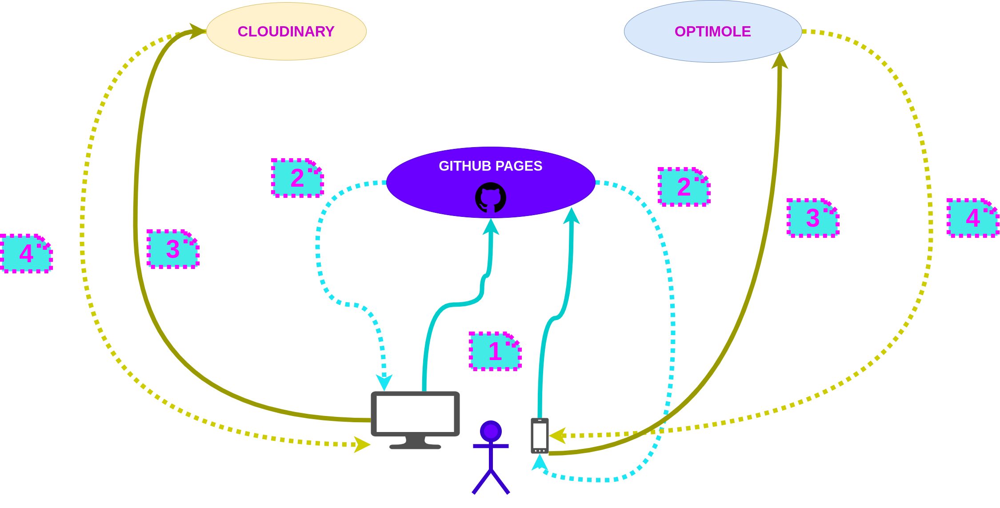
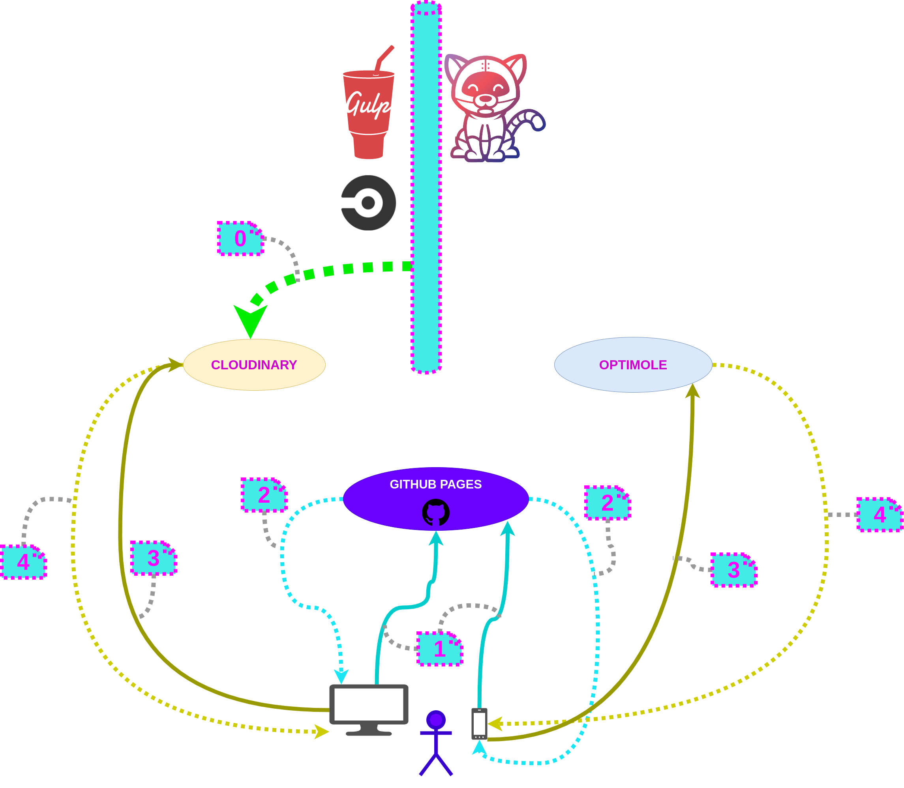
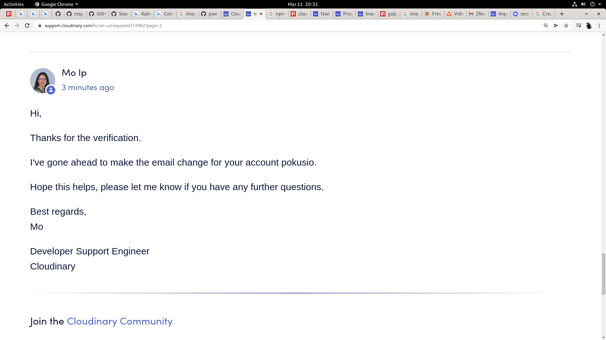
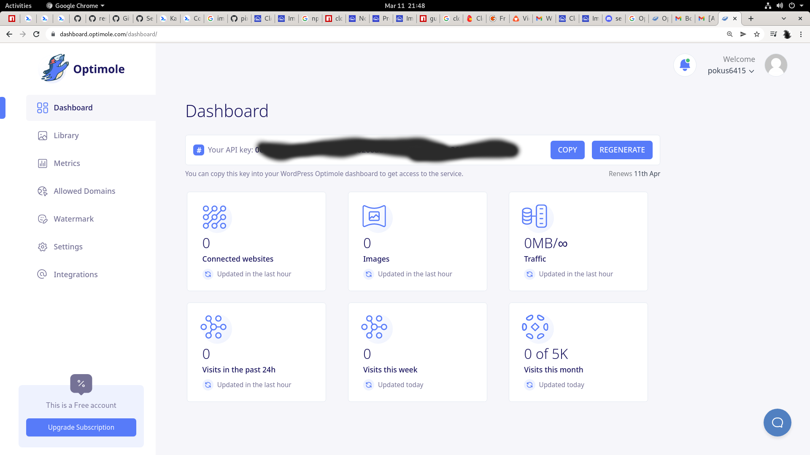
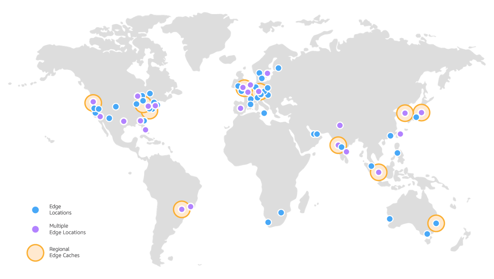

# The Radio Jaune Open Website

This repository version controls the code source the Radio Jaune Website : https://radiojaune.com


## How to build and run locally

### B.O.M.

* [`Hugo`](https://gohugo.io/getting-started/quick-start/#step-1-install-hugo)
* [`NodeJS`](https://docs.npmjs.com/downloading-and-installing-node-js-and-npm)
* [`Golang`](https://go.dev/doc/install)
*


* On MacOS X :

```bash
bash-3.2$ node -v
v14.15.0
bash-3.2$ npm --version
6.14.8
bash-3.2$ export PATH=$PATH:/usr/local/go/bin
bash-3.2$ go version
 https://vk.com/video_ext.php?oid=698175626&id=456239019&hash=162c1c4e1e027ead

go version go1.16.3 darwin/amd64
bash-3.2$ hugo version
Hugo Static Site Generator v0.78.2-959724F0 darwin/amd64 BuildDate: 2020-11-13T10:07:09Z
bash-3.2$ docker version
Client:
 Cloud integration: 1.0.17
 Version:           20.10.7
 API version:       1.41
 Go version:        go1.16.4
 Git commit:        f0df350
 Built:             Wed Jun  2 11:56:22 2021
 OS/Arch:           darwin/amd64
 Context:           default
 Experimental:      true

Server: Docker Engine - Community
 Engine:
  Version:          20.10.7
  API version:      1.41 (minimum version 1.12)
  Go version:       go1.13.15
  Git commit:       b0f5bc3
  Built:            Wed Jun  2 11:54:58 2021
  OS/Arch:          linux/amd64
  Experimental:     false
 containerd:
  Version:          1.4.6
  GitCommit:        d71fcd7d8303cbf684402823e425e9dd2e99285d
 runc:
  Version:          1.0.0-rc95
  GitCommit:        b9ee9c6314599f1b4a7f497e1f1f856fe433d3b7
 docker-init:
  Version:          0.19.0
  GitCommit:        de40ad0
bash-3.2$ docker-compose version
Docker Compose version 2.2.3
bash-3.2$ git version
git version 2.24.3 (Apple Git-128)
bash-3.2$ git flow version
1.12.3 (AVH Edition)
```

### Build n Run Locally

* Now build the hugo website in dev mode :

```bash
export DESIRED_VERSION=0.0.0
cd ~/yellowradio.work
git clone git@github.com:radio-jaune/website.git ~/yellowradio.work

git checkout ${DESIRED_VERSION}

npm run preps:all
# npm run spawn
# and then run :

export PATH=$PATH:/usr/local/go/bin && go version
hugo serve -b http://127.0.0.1:4545 -p 4545 --bind 127.0.0.1 -w

# try also :
export PATH=$PATH:/usr/local/go/bin
export HUGO_HOST=127.0.0.1
export HUGO_PORT=4547
export HUGO_BASE_URL=http://127.0.0.1:5445
export HUGO_BASE_URL=http://${HUGO_HOST}:${HUGO_PORT}
gulp build:dev
```

* Then start the hugo server in watch mode :

```bash
export DESIRED_VERSION=0.0.0
git clone git@github.com:radio-jaune/website.git ~/yellowradio.work
cd ~/yellowradio.work

git checkout ${DESIRED_VERSION}

npm run preps:all
# npm run spawn
# and then run :

export PATH=$PATH:/usr/local/go/bin && go version
hugo serve -b http://127.0.0.1:4545 -p 4545 --bind 127.0.0.1 -w

##
export PATH=$PATH:/usr/local/go/bin
export HUGO_HOST=127.0.0.1
export HUGO_PORT=4547
export HUGO_BASE_URL=http://127.0.0.1:5445
export HUGO_BASE_URL=http://${HUGO_HOST}:${HUGO_PORT}

# gulp hugo will only build the hugo website, it won't compile sass scss
gulp watch:dev

```

* production build :

```bash
##
export PATH=$PATH:/usr/local/go/bin
export HUGO_HOST=127.0.0.1
export HUGO_PORT=4547
export HUGO_BASE_URL=http://127.0.0.1:5445
export HUGO_BASE_URL=http://${HUGO_HOST}:${HUGO_PORT}

gulp build:prod

```


## How to re-generate this project

To see how this website looked when it started, and was automatically generated :

* Execute :

```bash
export DESIRED_VERSION=master
git clone git@github.com:radio-jaune/website.git ~/yellowradio.work
cd ~/yellowradio.work
git checkout ${DESIRED_VERSION}

npm preps:all
npm run spawn:project:clean && npm run spawn:project:gen

spawn:project:clean
spawn:project:gen
```

* Then run locally your new website :

```bash
export PATH=$PATH:/usr/local/go/bin
hugo serve -b http://127.0.0.1:5445 -p 5445 --bind 127.0.0.1 -w

# or try :
export PATH=$PATH:/usr/local/go/bin
export HUGO_HOST=127.0.0.1
export HUGO_PORT=4547
export HUGO_BASE_URL=http://127.0.0.1:5445
export HUGO_BASE_URL=http://${HUGO_HOST}:${HUGO_PORT}

gulp hugo
gulp serve
```


## How to release

* Release :

```bash
git clone git@github.com:radio-jaune/website.git ~/yellowradio.release.work
cd ~/yellowradio.release.work
git checkout master
git flow init --defaults

npm run preps

export RELEASE_VERSION=0.0.82
export DEPLOYMENT_DOMAIN=radiojaune.com
export DEPLOYMENT_BASE_URL=https://${DEPLOYMENT_DOMAIN}

git flow release start ${RELEASE_VERSION}


if [ -d ./docs ]; then
  rm -fr ./docs
fi;

if [ -d ./public ]; then
  rm -fr ./public
fi;

mkdir -p  ./docs
mkdir -p  ./public

oldHugoBuild () {
  export PATH=$PATH:/usr/local/go/bin
  hugo -b ${DEPLOYMENT_BASE_URL}
  cp -fr ./public/* ./docs/
}
gulpBuild (){
  export PATH=$PATH:/usr/local/go/bin
  export HUGO_HOST=${DEPLOYMENT_DOMAIN}
  export HUGO_PORT=4547
  export HUGO_BASE_URL=http://127.0.0.1:5445
  export HUGO_BASE_URL=http://${HUGO_HOST}:${HUGO_PORT}
  export HUGO_BASE_URL=https://radiojaune.com
  gulp build:debug:dev
  cp -fr ./dist/* ./docs/
}

# oldHugoBuild

gulpBuild

echo "${DEPLOYMENT_DOMAIN}" > CNAME
echo "${DEPLOYMENT_DOMAIN}" > ./docs/CNAME

git add -A && git commit -m "[${RELEASE_VERSION}] - release and deployment" && git push -u origin HEAD

# git flow release finish ${RELEASE_VERSION} && git push -u origin --all  && git push -u origin --tags
git flow release finish -s ${RELEASE_VERSION} && git push -u origin --all  && git push -u origin --tags

```

## Contributors guide

#### Debug the build

* Now build the hugo website in dev mode :

```bash
export DESIRED_VERSION=0.0.0
export DESIRED_VERSION=feature/superbeau-bouton

cd ~/yellowradio.work
git clone git@github.com:radio-jaune/website.git ~/yellowradio.work

git checkout ${DESIRED_VERSION}

npm run preps:all
# npm run spawn
# and then run :

# export PATH=$PATH:/usr/local/go/bin && go version
# hugo serve -b http://127.0.0.1:4545 -p 4545 --bind 127.0.0.1 -w

# try also :
export PATH=$PATH:/usr/local/go/bin
export HUGO_HOST=127.0.0.1
export HUGO_PORT=4547
export HUGO_BASE_URL=http://127.0.0.1:5445
export HUGO_BASE_URL=http://${HUGO_HOST}:${HUGO_PORT}
gulp build:debug
serve dist/ -l tcp://${HUGO_HOST}:${HUGO_PORT}

```

#### How to deploy PR branches with surge


```bash

export DEPLOYMENT_DOMAIN=raadio-jaune.surge.sh
export DEPLOYMENT_BASE_URL=https://${DEPLOYMENT_DOMAIN}

if [ -d ./docs ]; then
  rm -fr ./docs
fi;

if [ -d ./public ]; then
  rm -fr ./public
fi;

mkdir -p  ./docs
mkdir -p  ./public

oldHugoBuildNdeploy () {
  export PATH=$PATH:/usr/local/go/bin
  hugo -b ${DEPLOYMENT_BASE_URL}

  cp -fr ./public/* ./docs/
  surge ./public "${DEPLOYMENT_DOMAIN}"
}
gulpBuildNdeploy (){
  export PATH=$PATH:/usr/local/go/bin
  export HUGO_HOST=127.0.0.1
  export HUGO_PORT=4547
  export HUGO_BASE_URL=http://127.0.0.1:5445
  export HUGO_BASE_URL=http://${HUGO_HOST}:${HUGO_PORT}
  export HUGO_BASE_URL=https://${DEPLOYMENT_DOMAIN}
  gulp build:debug:dev
  surge ./dist "${DEPLOYMENT_DOMAIN}"
}

# oldHugoBuildNdeploy
gulpBuildNdeploy

```


#### Gitpod

We recommend to use Gitpod with IDE-integrated `nodejs` inspector client, with intention to debug the `gulp` build. The original issue was about having "glob errors" invoking 'gulp.src' (those errors seem to be very classic).

* https://radiojaune-website-2uvlb4xiykz.ws-eu33.gitpod.io/

* `.gitpod.yml` :
  * use it to
  * use it to
  * content :

```Yaml
# - .gitpod.yml

```


## Env


```bash
export HUGO_BASE_URL=https://127.0.0.1:5447
gulp hugo

```

## An idea about hot reloading

You know, whether i use BrowserSync or NodeMon, here is the "watch" configuration is 90% of the time want :
* I specify one folder like `./dist/`, and :
  * all files out of that folder are watched
  * all files within that folder are not watched,
  * that folder is served statically,
  * everytime any watched file is changed, the incremental build is relaunched from start, and server triggers page reload (jsut lke hugo dev server)
* So Ok I will try gulp-nodemon instead of BrowserSync, to compare and see if i have better

My first Gulp build has a design that satifies me, but I want to enlighten that topic.

I can also have a look a https://www.npmjs.com/package/chokidar

## The Gulp build and Image Processing

This task is about adding gulp tasks to :
* keep the original image file
* generate 3 to 5 resizing images file for responsiveness
* and since when you do that kind of processing, you end up with a lot of images :
  * you just keep the original image file in the source code, zero processed files should be in the git repo
  * you publish the images to a CDN
  * cloud service providers  :
    * the production and staging environments will use a managed CDN for images
    * and the development environment will use a CDN that is open source, provisioned in private infrastructure (with an open source private cloud provider like pokusbox), and broadcasted via noip ..?

* [ ] add gulp tasks to process images :
  * purpose 1 : add effects on images using ImageMagick :
    * There is no gulp-imagemagick plugin,
    * There are plugins using ImageMagick features to resize images for example,
    * but  A./ I want to use ImageMagick special effects commands, not resizing commands
    * and B./ I want a plugin which allows me to run any ImageMagick commands, not only resizing  commands
    * so i will use child_process and shelljs to run imagemagick commands
  * purpose 2 : For each image file, generate 3 to 5 resized images, using sharp / `gulp-sharp`
  * purpose 3 : compress all images files, will be done using imagemin / `gulp-imagemin`
* [ ] modify npm script to deploy images to CDN. The deployment process becomes :
  * deploy all images to CDN
  * if, and only if, all images were successfully deployed to CDN,
  * then the deployment of the website wan happen (the deployment of the static site to the static web server)
  * This new deployment makes it required that we use a staging environment, to deploy to a different CDN on staging and production envs : indeed, if the image deployement fails, it will then never impact in any way the production environment

### Benchamrk CDN services

Image services like  (open-source) and [Cloudinary](https://cloudinary.com/) are also worth checking out. Image services provide responsive images (and image manipulation) on-demand. Thumbor is setup by installing it on a server; Cloudinary takes care of these details for you and requires no server setup. Both are easy ways to create responsive images.
We need a benchmark there, at least between :
* [Thumbor](https://github.com/thumbor/thumbor)
* [Cloudinary](https://cloudinary.com/)
* cloudflare
* I found another `CDN` which gives a free plan, to assess : https://gcorelabs.com/cdn/free/

Another important aspect about using CDNs for projects with zero or litle money :

* In those projects, we will consume free plan until it's exceeded every month.
* Let's not drop the idea of using `CDN`s, just because we haven't got any money.
* So to still use `CDN`, here is an idea :
  * We setup `upptime` https://github.com/upptime/upptime
  * and we setup some tests on all images : when it is a 404,; we need a RED ALERT notification on chatops (discord clask rocket chat zulip, etc..)


And last but not least, here is my main architectrure design:
* defining the entire processing lifecycle of images, from git commit to production,
* main goal is to use several `CDN` free plans :
  * to maximize our `CDN` capacity, without paying
  * to avoid dropping the `CDN` feature, just because people do not know yet how oor if they are going to have enough money to pay CDN when trtaffic increases.
* i will use both cloudinary and optimole : cloudinary only for png (because it is the only thing its good at according a few reviews i read), and oinly les than 5 image files, like the most important ones taht are for unflold into SMS and things like Telegram channels, chats etc...

Here is the architecture to use both `CDN` :






* step 0. ccc
* step 1. ccc
* step 2. ccc
* step 3. ccc
* step 4. ccc


How to run Optimole tests :
* https://optimole.com/test-drive?results=107102
* idea : assess how worth it is to use Optimole CDN for your website.
* For https://radiojaune.com , the test did not find any image : that' becasue all of images are nested in CSS? so wie will try the css classes configuration setup to re-assess the effect.
* Also i would definitely like to have that test tool as open osurce... At least being able to run such tests inside Pipelines.

##### Cloudinary

One point in the benchmark i want to note : I had relations with cloudinary supprt team, and they are really great very fast, technically sharp.




 About the pricing of Cloudinary :


Ok, so basically, here are the limitations :

* My biggest iamge file is `│   ├── [773K]  logo.png`, so I will say 800 Kilobytes (800 Ko)
* Now, If I assume:
  * that the website has only 100 vistors per day
  * that the maximum number of users loading a page is 50.
  * that each of those users :
    * reloads the one and only page says 5/10 times, then its wroser etc... will use it cache
    * forces reload of page twice on every visit
  * that the website uses CDN for only 5 image files of that same 800Ko size
  * Well, then in the end, here are the figures of consumption :
    * `How much` : a 100 times a day, 5 images of each 800 Ko = 100 x 5 x 800 Ko = 400 000 Ko = 400 000 / 1024 Mo (Mb) = 390.625 Mo (Mb)

    * So ok, this means that during one day, 400 mega bytes of images will be loaded
    * fre pan is 25 credits, and one credit is : 1 GB either in banwidth or volume. SO I guess i have at least 25 this amount does not exceed free plan capacity
    * Now, i can buy credits. So question is, if i buy 1000 credits, how muhch more image CDN can i use ?


##### External Benchmarking sources

https://themeisle.com/blog/cloudinary-vs-imgix-vs-imagekit-vs-optimole/

If you’re short on time, here’s a quick summary of our results:

* Optimole was the best at optimizing our test JPEG image.
* Cloudinary was the best at optimizing our test PNG image (but also the worst at optimizing our test JPEG).
* Optimole had the best overall optimization when looking at both the JPEG and PNG images.
* Optimole and Cloudinary had the easiest setup process for WordPress users. You can be up and running on WordPress with just a few clicks and don’t need to deal with any technical steps.

So i'll try Optimole, just to compare pricing at least, for a first try

Also:
* why not using several free plans on different CDN providers ?
* eg I use Optimole for 5 images, and i use Cloudinary for 5 other images. I double my free plan that way
* and can i use a gulp plugin for image CDN upload, that has the following features :
  * the gulp task end by sending metrics to prometheus
  * the gulp task is configured via a `JSon` file : that `JSon` file is like

##### Optimole CDN

* register process is extremely easy
* they do have a free plan
*
* https://docs.optimole.com/category/1011-cdn

When  registration finished, i immediately get the API Key, (an,d that i liked, at cloudinary dashboard, i had to struggle a bit to find the menu to get my api key) get :



What is funny about `Optimole` :
* There is a lot of integration for Wordpress :
  * i was afraid first, that no other support would be there,n at least a CLI to upload images
  * but they did think about non-wordpress websites : https://docs.optimole.com/article/1307-custom-integration
  * now, it is a very good omen that they are so focused on WordPress : this means they are very much into websites dev, while cloudinary seems big and solid, but has much broader features. I like do what you do best.


Ok so here is what i found to integrate with gulp on https://docs.optimole.com/article/1307-custom-integration :

In three sentences, how optimole integration works :
* you add one css, and one js references into the HEAD html trag of your website
* for each html tag which has an image as background, you add a tag data attribute like this :
* by default, all images urls in my website are replaced by the optimole JS module referenced in HEAD
* by default, all images urls referenced in CSS are not processsed :
  * in the Optimole dashbard, i can set anq option to tell optimole to scan the CSS too
  * Optimole will process a CSS referenced image, if and only if:
    * in the Optimole dashboard settings, we activated that option, and we added the `.tintin.and.milou` css class
    * and that image is loaded as background image for an HTML element which is marked with a css class we added to the settings, jsut like the `.tintin.and.milou` css class.
*


To give an idea of how our optimole CDN will geographjically deliver, here is a world map of the underlying Optimole CDN :




### `Gitops` Corner

In my gitops fluxcd work, i want to work on one business case i find here :
* I want to use FluxCD / Flagger and a monitoring stack, to deploy the same website we are talking about here
* And the Monitoring Stack will especially detect an image error, pas it to Flagger to roll back the deployment, to previous version.


## Annex A. Funny little thing that happened with https://api.video

Hello, thank you so much for your answer.

I tried registering only once yesterday

I clicked the Github button, and then I granted authorization to api.video Github OAuth2 application.

Then, the registration process forced me to use the email address associated with my Github Account, so I just closed the window exactly there.

After that, I went to my github Account to revoke granted Github permissions to api.video

And now, it does not matter what I do, I just end up with the blank page with only one eror message :

"We encountered an error trying to retrieve your workspaces "

My guess is that there is a bug inside the https://api.video  website authentication moidules.

What happens is that the  https://api.video saas is trying to fetch my github repositories, using the Github token they got as I authorizd the Github Application.
But it fails to, because i revoked the token to force resume the registration from start.


## The Rdog (wouaf wouaf)

#### R language installation

see:
* https://cran.r-project.org/
* https://support.rstudio.com/hc/en-us/articles/201141096-Getting-Started-with-R

* `Debian` :

```bash
# ---
sudo apt-get update -y
sudo apt-get install -y r-base r-base-dev

```

#### Rdog first touch

https://cran.r-project.org/


### References

* https://github.com/ImageMagick/ImageMagick
* https://github.com/lovell/sharp
* https://www.npmjs.com/package/gulp-beautify
* https://www.npmjs.com/package/gulp-seo
* https://www.npmjs.com/package/gulp-newer
* You are my hero :
* https://tutorialmeta.com/question/instead-change-the-require-of-index-js-to-a-dynamic-import-which-is-available , for solving my gulp issue qith `gulp-imagemin` npm package
* CDN :
* https://www.npmjs.com/package/cloudinary
* https://www.npmjs.com/package/gulp-cloudinary-upload
* https://cloudinary.com/documentation/node_integration#node_js_getting_started_guide
* and im sure we have same for cloudflare, and other alternative CDNs.
* images processing : https://www.npmjs.com/package/gulp-sharp
* He speaks about Google Lighthouse too (about the image compression strategy) : https://dev.to/feldroy/til-strategies-for-compressing-jpg-files-with-imagemagick-5fn9
* Very important reference from people at google :
* https://web.dev/use-imagemin-to-compress-images/
* https://web.dev/authors/katiehempenius/
* https://web.dev/lighthouse-ci/ : performance monitoring
* https://cloudinary.com/documentation/node_integration#installation_and_setup
* `ImageMagick` friends :
  * http://www.graphicsmagick.org/
  *
