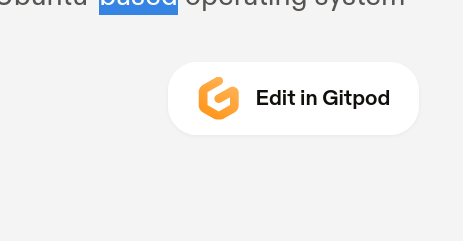

# Gitpod

I used Gitpod to use its IDE-integrated nodejs inspector client, with intention to debug the gulp build. The original issue was about having "glob errors" invoking 'gulp.src' (those errors seem to be very classic).

* https://radiojaune-website-2uvlb4xiykz.ws-eu33.gitpod.io/

## The story

* You login gitpod.io with Github OAuth2, and gives access to the Gitpod.io Github OAuth2 App, to this github reposiotry (permissions to read meta data, permissions to read commits and permissions to git push new commits)
* When you try and run the first time the gitpod debugger, it is suggested to create a launch.json file, to configure what will be executed by gitpod, when running the debugger :


<!--  -->


* https://www.gitpod.io/docs/languages/go
* I want the "Edit in gitpod" button option on all of my hugo themes :



* https://www.gitpod.io/docs/config-docker
* https://www.gitpod.io/docs/config-gitpod-file
* Ok, so  for a nodejs environement in gitpod, I now have to create a `.gitpod.Dockerfile` :

```bash

# The tesks define what is executed in the gitpod; just like in a pipeline
cat<<EOF >./.gipod.yml
image:
  file: .gitpod.Dockerfile
  # Commands to start on workspace startup
  tasks:
    - init: npm run preps && node --version
    - command: gulp build:debug
    # - command: node --inspect --inspect-brk $(which gulp) build:debug
  # Ports to expose on workspace startup
  ports:
    - port: 9229
      onOpen: open-preview
EOF

# # --- --- --- --- --- --- --- --- --- --- --- --- --- --- --- --- --- --- --- --- --- --- --- ---
# # --- --- --- --- --- --- --- --- --- --- --- --- --- --- --- --- --- --- --- --- --- --- --- ---
# # - # - #   node --inspect --inspect-brk $(which gulp) build:debug
# # - # - #   Debugger listening on ws://127.0.0.1:9229/090212dd-b7a5-45a5-be01-a0036915f2a6
# # - # - #   For help, see: https://nodejs.org/en/docs/inspector
# # --- --- --- --- --- --- --- --- --- --- --- --- --- --- --- --- --- --- --- --- --- --- --- ---
# # --- --- --- --- --- --- --- --- --- --- --- --- --- --- --- --- --- --- --- --- --- --- --- ---

cat <<EOF >./.gitpod.Dockerfile
FROM gitpod/workspace-full:latest

RUN bash -c 'VERSION="14.8.0"     && source $HOME/.nvm/nvm.sh && nvm install $VERSION     && nvm use $VERSION && nvm alias default $VERSION'

RUN echo "nvm use default &>/dev/null" >> ~/.bashrc.d/51-nvm-fix
EOF

# Well, it looks like if I use the .gitpod.yml, then i wil be able to define which tasks are executed
# Now, what is executed in the gitpod, at startup time :
#     => coudl execute the nodejs inspector server,
#     => but then we would still miss the connection to the IDE's nodejs inspector client.
mkdir -p ./.theia/
cat <<EOF >./.theia/launch.json
{
    // Use IntelliSense to learn about possible attributes.
    // Hover to view descriptions of existing attributes.
    "version": "0.2.0",
    "configurations": [
        {
            "type": "node",
            "request": "launch",
            "name": "Launch Gulp Build Debug",
            "program": " --inspect --inspect-brk /home/gitpod/.nvm/versions/node/v16.13.2/bin/gulp build:debug",
            "openDebug": "openOnDebugBreak",
            "internalConsoleOptions": "openOnSessionStart"
        }
    ]
}
EOF


git add -A && git commit -m "gulp config + gitpod gulp debug" && git push -u origin HEAD


# https://www.gitpod.io/docs/config-docker#manually-rebuild-a-workspace-image
export HTTP_URI_OF_GITHUB_REPO="git@github.com:radio-jaune/website.git"
export HTTP_URI_OF_GITHUB_REPO="https://github.com/radio-jaune/website.git"

curl -ivvv -X GET "https://gitpod.io/#imagebuild/${HTTP_URI_OF_GITHUB_REPO}"
```

* https://www.gitpod.io/docs/config-docker#manually-rebuild-a-workspace-image :

>
> You can trigger a workspace image rebuild with the following URL pattern: https://gitpod.io/#imagebuild/<your-repo-url>
>


### About custom gitpod images

>
> When you launch a Gitpod workspace, the local console will use the gitpod user, so all local settings, config file, etc. should apply to /home/gitpod or be run using USER gitpod (we no longer recommend using USER root).
>
